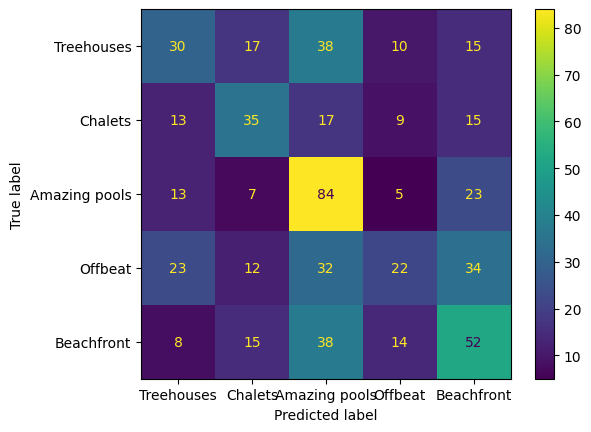

# Modelling Airbnb's Property dataset

In this project, we aim to use a dataset of Airbnb properties along with accompanying images to build, train, tune, and evaluate models on that dataset.

The project is split into a few parts, namely;
- **Data cleaning and handling**. Here we evaluate the input airbnb data and clean it by removing certain rows with null values, cleaning the descriptions column into a readable string, as well as selecting only numerical parts of the whole dataframe.
- **Creating a Baseline model**. During this step, we create a Linear Regression model and evaluate its performance on our validation set using metrics such as RMSE and $R^2$. I the classification case, this is done with a Logistic Regression model evaluating accuracy, recall, and the F1 score instead.
- **Evaluating the models**. Here we evaluate the models performance against the criterion of our choosing.
- **Optimising the model**. Finally, we tune the model by cycling through different hyperparameter combinations using GridSearchCV, and also differnt models as well (Decision Tree's, Random Forests etc.) Then we can assess which model gives us the best performance overall.

## Data Preparation
The first step is to read in the data from the listings.csv file, and clean any necessary parts of the original data.

### Data Cleaning ###
Here, we perform data cleaning on our source data. Firstly, we load the csv file as a DataFrame to then explore the dataset for any missing values, rows with null values, or data that looks incorrect/out of place. In our case, rows were removed when given columns were missing values. Other columns that had missing values we set defaults in their place, and the description column had it's string representations of the description of a property cleaned up.

## Regression models
The first set of models that we used in this project were regression models, which are used to predict a continuous value, such as the Price_Night column of our dataset.

For such models, we typically want to minimise, or optimise, a particular loss funcion/parameter. One way of doing this is via gradient descent. A particular variant of this is Stochastic Gradient Descent.

### Stochastic Gradient Descent
For a linear model, we make a prediction, denoted by $\widetilde{y}$, of our feature. The equation for this is:

$$
\widetilde{y} = h(x) = x \cdot w_0+b
$$

In this equation $w$ represents the weight vector, which is a vector containing the weights for every input in the parameter vector $x$, and $b$ is a bias value. In linear models, this can be linked to the intercept and slope. The loss function can be written as:

$$
L = \frac{1}{N}\sum_{i=0}^{N-1}(y_i-\widetilde{y}_i)^2
$$

This calculates the sum of the residuals for each observation and our estimated value. We want to take the derivative of this function with respect to the parameters, in our case our weights. We can do so via:

$$
w_{i+1} = w_i - \eta \nabla L.
$$

$\eta$ here denotes the learning rate which dictates how much we change our weights by. We are updating the parameters, $w$, in the opposite direction of the gradient of the loss function w.r.t. the parameters, hence the minus sign. The new weight vector is substituted back into our prediction $\widetilde{y}$ giving us a new model, which we then use when taking the derivative of the loss function with the updated parameters. We repeat this process until the weight vector converges to an optimal vector

$$
w_i \longrightarrow{} w^*.
$$

### RMSE and $R^2$
RMSE is a certain type of loss function commonly used in regression problems and measures the distance between a predicted value and the actual value. For a given prediction, $\widetilde{y}_i$, and a real value given by ${y}_i$, the RMSE is measured by

$$
RMSE = \sqrt{\sum_{i=1}^{N}\frac{(\widetilde{y}_i-y_i)^2}{N}},
$$

where $N$ is the total number of data points.

$R^2$, or the coefficient of determination, is a value in the range [0, 1] and measures the proportion of variation in the data that is accounted for in the model. The equation for $R^2$ is

$$
R^2 = 1 - \frac{\sum (y_i - \widetilde{y}_i)^2}{\sum (y_i - \bar{y}_i)^2}
$$

where $\bar{y}_i$ is the mean of the actual data. Values close to 1 means the the data is strongly correlated between its variables i.e. an $R^2$ value of 0.9 means the relationship between the variables explains 90% of the variation in the data. Values close to 0 indicate little or no correlation.

We use both RMSE and $R^2$ as measures of how well our regression models fit the data when predicting our Price_Night label. The closer a value of $R^2$ to 1, the better our predictions are compared to the real data.

### Hyperparameter tuning
The next step is to then turn our attention to evaluating the model when using different sets of hyperparameters. Each model utilises different hyperparamaters. We want to assess which combination of hyperparamaters results in the lowest loss, in our case the lowest RMSE and $R^2$. Thus, we iterate over all permutations of hyperparameters, fitting the model with that specific set of hyperparameters, and evaluate the models performance. The best scoring model is returned, returning the corresponding set of hyperparameters that gave us that score. sklearn has a class called GridSearchCV that implements hyperparameter tuning. Important to note that when testing the hyperparameters of a model, we evaluate this on the validation set and not the train set.

### Model evaluation
We try to find the "best" model, which as stated above is going off our RMSE metric. To find the best performing model, we find the model with the lowest RMSE score for the testing set, as this is the ultimate test; does the model we have trained generalise well to unseen data. A low score of the loss on training set but a high score on the test/validation set is indicative of overfitting. All of the code for the regression part of this project can be found in the modelling.py file.

## Classification
In this section we move onto classifiaction, where we try to predict the Category of a given house based of the other features. Here, Category takes on a set of discrete values, hence the need to use a classification algorithm.

### Logistic model
$$
p(x) = \frac{1}{1+e^{-(xb)}}
$$

The logistic function outputs a probability that a certain observation belongs to a given class. The nature of the above equation is a sigmoid function, which forces values to within the range [0, 1]. In our case, we are trying to classify more than just a binary output and so we need to use multinomial logistic regression.

### Metrics
There a few different ways in which to quantify how well a classifier has performed. We go through the main ones below.

#### Accuracy
Accuracy measures the number of correct predictions as a percentage of total predictions made. In our example, this would be the total number of correct predictions of an instances category divided by the total number of instances a prediction is made on.

#### Precision
The precision score is the accuracy of positive predictions, or in other words the ratio of true positives (correct classifications for a given class) over the total number of entries predicted for that class (so true positives added to false positivies - incorrect classifications for a given class)

$$
precision = \frac{TP}{TP + FP}
$$

#### Recall
Recall is the ratio of true positive instances over the sum of all instances of that class. This gives a percentage of coming across a correct/true prediction.

$$
recall = \frac{TP}{TP + FN}
$$

#### F1 score
A convenient way to combine both precision and recall is the F1 score. It is the harmonic mean (meaning giving more weight to low values) of precision and recall, meaning a high F1 score is only ahcieved in the case of high recall and precision.

$$
F_{1} = 2 \times \frac{precision * recall}{precision + recall} = \frac{TP}{TP + \frac{FN + FP}{2}}
$$

#### Confusion matrix
Confusion matrices give a way of checking the predictions made against the true class. Every row in a confusion matrix represents a class (category in our case) while each column represents a predicted class. Here is the confusion matrix from our best model classifier

With an ideal classifier (i.e. one that is 100% accurate) you would only have numbers in the leading diagonals and 0's everywhere else. As we can see from this image, for a given class there are a lot of predictions of other clases, only semeingly does the category 'Amazing Pools' seem to have any degree of high correct classification rate.

### Results
From running the different classification models (we iterated over a decision tree classifier, gradient boosting classifier, logisitc regression, and random forest regressor), the best scroing model was a logistic model which had a precison score of 0.516, a recall score of 0.435 and an F1 score of 0.464, and an accuracy of 0.435. This tells us that this model correctly predicts the categopry of a listing only 43.5% of the time. This is just over twice as good as randomly selecting from any of the categories (5 categories give a 20% chance of a correct prediction when randomly predicting a category). All of this tells us that from the data we have trained on, there is a correlation between numeric features and predicting the category, however this correlation is fairly weak and does not translate well into predicting new examples.

## Neural Network
A Neural Network consists of one or more inputs which form the input layer, one or more hidden layers within the network, and then a final output layer. How many layers one uses is specific to the problem and something one needs to figure out; simply increasing the layers of a neural network does not gurantee a better performance of the model. Within each layer are nodes (or neurons) which can either be on or off (such on/off neurons are known as perceptrons). These neurons take inputs $x_{1}, x_{2}, \dots, x_{n}$ and each input has a weight associated with it's importance to the output, $w_{1}, w_{2}, \dots, w_{n}$. For a simple neuron, the output of 0 or 1 is determined by whether the weighted sum $\sum_j=w_{j}x_{j}$ is less than or greater than some threshold value. The output of this neuron is then fed as an input to a neuron in the next layer within the neural network, and so on until you reach the output of the neural network.

We then turned our attention to predicting the price via the use of a Neural Network. The first step here required us to create a custom Dataset class, one that returns the relevant columns of our dataframe. We then bacthed these examples up into what's known as loaders, namely a train, test, and validation loader.

Our Neural Network consists of linear models, where the outputs are then passed to an activation function. An activation function is needed since without one a neural network is esntially just a linear regression model. The sum of the weights and biases are then passed to the activation function which then yields an output. In our model we used the ReLU activation function.

We first experimented with the learning rate of our model and the width of our hidden layers, which we found to be 0.1 and 11-5 respectively. We also then tuned the model to use different optimisers with varying learning rates and hidden layer widths and trained each permutation of these models to get the best model (measured by lowest RMSE). The results of the best model for the training, validation and test sets are below:

|Metric|Training set          |Validation set |Test set|
|------|----------------------|---------|--------------|
|$RMSE$|$108.594$|$126.235$|$107.619$|
|$R^2$ |$0.106$|$0.185$|$0.299$|

What do these results tell us? Across all data sets, the RMSE is over the hundred mark. Considering that most properties in this dataset have an average house price of 154.172, we can't really draw conclusions on the house price from the data we have since the error is almost as large as the values themselves! The low $R^2$ values also indicate little correlation between our features and our target variable. In short, despite the parameter tuning that resulted in better refined models, the underlying data doesn't seem to present any strong correlation between the numeric features and the price per night of a property.

